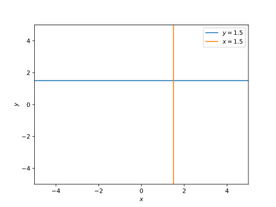
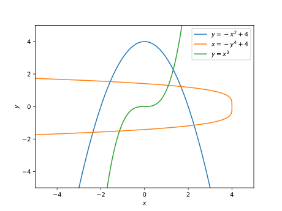

# Worksheet 00: Maths revision- solutions

Only brief solutions are given here. If you have any questions please come along to your tutorial or ask questions in the Class Team.

1. a. $1$
	b. $1$
	c. $1$
	d. $4$
	e. $1$
	f. $0.25$
	g. $100$
	h. $-1$
	i. $0.01$
	j. $0.5$
	k. $0.\overline{3}$
	l. $0.\overline{7}$
	m. $\frac{1}{40} = 0.025$
	n. $\frac{21}{9} = 2 + \frac{3}{9} = 2 + \frac{1}{3} = 2.\overline{3}$
	o. $1$
	p. $955.\overline{5}$
	q. $0.093$

2. There are many answers for this questions with a good summary on wikipedia:
   <https://en.wikipedia.org/wiki/0.999...>

	Some of the simplest include that:

	- $0.\overline{3} = 1/3$ so $0.\overline{9} = 3 \times 0.\overline{3} = 3 \times 1/3 = 1$;

	- $$
	\begin{aligned}
	x & = 0.99\overline{9} \\
	10 x & = 9.99\overline{9} && \mbox{ by multiplying by 10} \\
	10 x & = 9 + 0.99\overline{9} && \mbox{ by splitting off the integer part} \\
	10 x & = 9 + x && \mbox{ by definition of $x$} \\
	9 x & = 9 && \mbox{ by subtracting $x$} \\
	x & = 1 && \mbox{ by dividing by 9}.
	\end{aligned}
	$$

3. a. a. 1
      b. 1
	  c. 1
	  d. 1
	  e. 1
	  f. 2
	  g. 1
	  h. 1
	  i. 1
	  j. 1
	  k. Infinitely many
	  l. Infinitely many
	  m. 2
	  n. Infinitely many
	  o. 1
	  p. Infinitely many
	  q. 2

	b. k. $0.3333$ to 4 s.f., $0.33333$ to 5 s.f., $0.333333$ to 6 s.f.
	   l. $0.7778$ to 4 s.f., $0.77778$ to 5 s.f., $0.777778$ to 6 s.f.
  	   m. $0.02500$ to 4 s.f., $0.025000$ to 5 s.f., $0.0250000$ to 6 s.f.
       n. $2.333$ to 4 s.f., $2.3333$ to 5 s.f, $2.33333$ to 6 s.f.
       o. $1.000$ to 4 s.f., $1.0000$ to 5 s.f., $1.00000$ to 6 s.f.
       p. $955.6$ to 4 s.f., $9555.6$ to 6 s.f., $9555.56$ to 6 s.f.

4. a. $2$ -- just one solution, although we note that $-2 \times -2 = 4$ also.

	b. $3$ -- just one solution

5. a. $8 \times 6 = 48 \, \mathrm{cm}^2$.

	b. $\sqrt{6^2 + 8^2} = \sqrt{36 + 64} = \sqrt{100} = 10\, \mathrm{cm}^2$.

	c. $12 \times 16 = 192$ tiles.

	d. $\mathrm{ceil}(8/w) \times \mathrm{ceil}(6/h)$ tiles covers the rectangle without splitting any tiles.
       A further exercise would be to work out how many tiles are required if you can split the tiles along straight edges.

6. a. $14$

	b. Note that $3 (0.25)^{1/2} = (3^2 \times 0.25)^{1/2} = (2.25)^{1/2}$.

7. a. Slope: $-1.5$, $y$-axis intercept: $6$, yes - can be written as $y = f(x)$

   b. Slope: $1.5$, $y$-axis intercept: $-6$, yes - can be written as $y = f(x)$

   c. Slope: $0$, $y$-axis intercept: $1.5$, yes- can be written as $y = f(x)$

   d. Slope: undefined, $y$-axis intercept: no, no- cannot be written as $y = f(x)$.

8. Write the equation of the straight line as $y = m x + b$. Substituting the equations for the points gives:

   $$
   \begin{aligned}
   -1 & = m \times 1 + b \\
   2 & = m \times 7 + b
   \end{aligned}
   $$

   Subtracting the first equation from the second gives

   $$
    3 = 6 m,
   $$

   which gives $m=\frac{1}{2}$. This can be substituted into the first equation to give $b=-\frac{3}{2}$.

9. a. $(4, 0)$
      

	b. $(1.5, 1.5)$
      

10. a. is a quadratic equation and can be written as a function $y = f(x)$
	b. is a quartic equation and cannot be written as a function $y = f(x)$
	c. is a cubic equation and can be written as a function $y = f(x)$.

	

11. The problem can be formulated as the system of equations:

	$$
	\begin{aligned}
	f + s + t & = N \\
	s & = 2 t \\
	s & = 3 f.
	\end{aligned}
	$$

	Solving the system of linear equations gives

	$$
  f = \frac{2}{11} N, \qquad s = \frac{6}{11} N, \qquad t = \frac{3}{11} N.
  $$

    So the fraction of students getting a second class degree is $\dfrac{6}{11}$.
